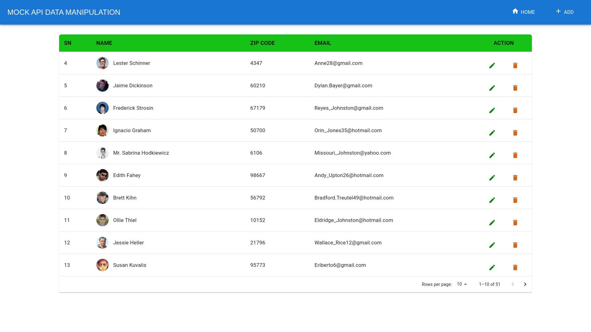

# React CRUD operations using mockAPI

## A React App based on dummy data from mockAPI

This is a React Project that I made as my first React Project. This React App uses mockAPI to get data and performs CRUD operations like ADD, EDIT, DELETE.

`The following screenshot is a homepage view of the App.`

